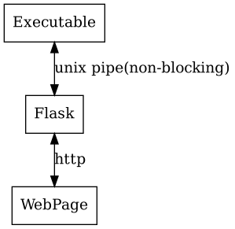

# Documentations of Ticket System

## 整体架构

### Backend

### Project

## 缓存设计

### train_cache::LRU（SLRU）

设计时参照了mmap的思路，将文件的对应位置的块直接映射至内存中，依赖于人工调用的dirty_bit_set()实现写入一致性

##### bool remove(DiskLoc_T offset)

从cache中移除对应offset的块，并依照dirty_bit将修改后的数据写回磁盘

##### DataPtr get(DiskLoc_T offset)

若在cache里则返回对应地址，否则从磁盘中读取数据至cache中并返回

##### void set_dirty_bit(DiskLoc_T offset)

手动设置块对应的dirty_bit

### t_sys::PageManager

以页为单位的缓存，从磁盘读入时需内存复制两次，因此效率不及LRUCache，但优势在于容易使用

##### void read(char* dst, DiskLoc_T offset, size_t size)

从offset中读取size大小数据至dst指向的内存空间中

##### void write(const char* src, DiskLoc_T offset, size_t size)

将src指向的size大小数据写入offset对应的磁盘地址中

### 缓存大小

根据实际需求进行fine tune

## 数据成员

### LRUBPTree

##### metadata

| 字段          | 描述                 |
| ------------- | -------------------- |
| file_size     | 文件大小             |
| freelist_head | 第一个空闲块的offset |
| root          | 根结点offset         |

##### records

| 字段           | 描述                           |
| -------------- | ------------------------------ |
| type           | non leaf or leaf nodes         |
| offset         | -                              |
| next           | 后继结点（仅对type==LEAF生效） |
| prev           | 前驱结点（仅对type==LEAF生效） |
| size           | K的大小                        |
| K              | key数组                        |
| V or sub_nodes | v或子结点数组，size=size(K)+1  |

### UserManager

| 字段      | 描述              |
| --------- | ----------------- |
| file_size | -                 |
| is_null   | 是否size(用户)==0 |

### TrainManager

| 字段            | 描述                          |
| --------------- | ----------------------------- |
| trainidToOffset | train name到偏移量的索引      |
| stationTotrain  | <站，列车> -> 站是列车的第x站 |
| trainlist       | id -> train name              |
| stationlist     | station name -> id            |

##### train_t

变长构造，每次根据stationNum进行不同的读取和写入操作

### UserOrderManager

块状链表优化

##### __order_block

| 字段 | 描述                |
| ---- | ------------------- |
| next | 下一个block的offset |
| size | data中order个数     |
| data | size个order         |

### PendingOrderManager

| 字段          | 描述                 |
| ------------- | -------------------- |
| file_size     | 文件大小             |
| freelist_head | 第一个空闲块的offset |

##### allocate_tickets()

遍历候补队列，依次使满足条件的order状态变为success

## 操作说明

### UserManager

- Add_user: 添加用户至用户信息
- Login: 用户未登录时执行登录
- logout: 登出
- Query_profile: 查询信息
- Modify_profile: 修改信息，具有原子性
- Query_order: 调用UserOrderManager查询订单信息

### TrainManager

- Add_train: 添加信息，对列车时间、价格进行前缀和处理
- Delete_train: 删除列车
- Release_train: 发布列车，对票数进行初始化
- Query_train: 查询列车信息
- Query_ticket: 枚举经过两个站的列车，取交集
- Query_transfer: 枚举经过始发站的列车1,经过终点站的列车2,检测是否有共同的站点，有交集且合法则加入比较
- Buy_ticket: 购票，并更新UserManager，UserOrderManager及PendingTicketManager信息
- Refund_ticket: 退票，并调用PendingOrderManager尝试匹配候补订单

### Misc

- clean: 删除所有文件，对内存对象进行析构
- exit: 正常析构退出

## 文件用途

- offset.dat: `TrainManager::trainOffset` 序列化对象
- order_manager.db: 所有用户的订单信息
- pending.db: 候补信息
- station.dat: `TrainManager::stationlist` 序列化对象
- ticket.dat: `TrainManager::trainlist` 序列化对象
- train_id.idx: `TrainManager::trainToOffset` BPT
- train_manager.db: 所有列车的信息
- train_station.idx: `TrainManager::stationToTrain` BPT
- user_manager.db: 用户信息
- user_manager.idx: `UserManager::usernameToOffset` BPT